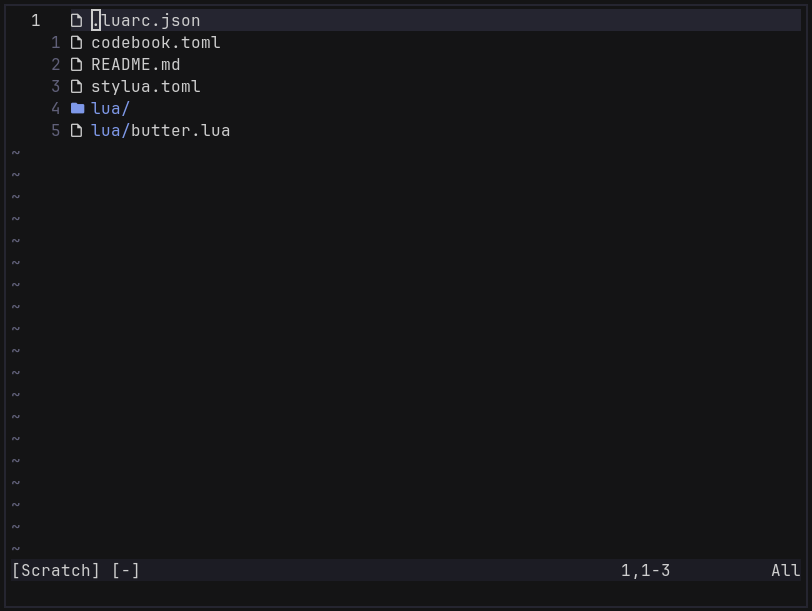

# butter.nvim

A minimal, buttery-smooth file explorer for Neovim. Inspired by [oil.nvim](https://github.com/stevearc/oil.nvim).



## Differences with oil.nvim

- Butter has keymaps for file operations instead of editing the buffer directly.
- Butter shows all files and folders at once, instead of needing to navigate through folders.

## Requirements

- Neovim 0.10+ (uses `vim.system`)
- [fd](https://github.com/sharkdp/fd)
- Unix commands: `mkdir`, `touch`, `mv`, `cp`, `rm` (used for file operations)
- [nvim-web-devicons](https://github.com/nvim-tree/nvim-web-devicons) (optional, for file icons)

## Install

With [lazy.nvim](https://github.com/folke/lazy.nvim):

```lua
{
  "patrickswijgman/butter.nvim",
  config = function()
    require("butter").setup()
  end,
}
```

With `vim.pack`:

```lua
vim.pack.add({
  "https://github.com/patrickswijgman/butter.nvim",
})

require("butter").setup()
```

## Usage

Run `:Butter` to open the explorer in the current window, with the cursor on the
file you were editing. Inside the buffer:

| Key               | Action                                                     |
| ----------------- | ---------------------------------------------------------- |
| `o` / `enter`     | Open the file or directory under the cursor                |
| `-` / `backspace` | Go up to the parent directory                              |
| `a`               | Add a file or directory (trailing `/` creates a directory) |
| `m`               | Move / rename                                              |
| `c`               | Copy                                                       |
| `d`               | Delete (with confirmation)                                 |

Add it as a keymap in your config:

```lua
vim.keymap.set("n", "<leader>e", "<cmd>Butter<cr>", { desc = "Open file explorer" })
```

## Configuration

`setup()` takes an optional table. These are the defaults:

```lua
require("butter").setup({
  show_hidden = false, -- pass --hidden to fd
  no_ignore = false,   -- pass --no-ignore to fd (don't use .gitignore etc.)
  exclude = {},        -- paths to exclude, e.g. { ".git", "node_modules", "dist" }
  sort = nil,          -- custom table sort function; or set to false to keep fd's order; or set to nil for directory-first sorting
  auto_open = false,   -- open Butter when Neovim starts with a directory, e.g. `nvim .`
})
```

Note that if you set `auto_open` to `true`, be sure to disable `netrw` (Neovim's builtin file explorer) to prevent race conditions.
Add this to where you set your options for Neovim:

```lua
vim.g.loaded_netrw = 1
vim.g.loaded_netrwPlugin = 1
```
